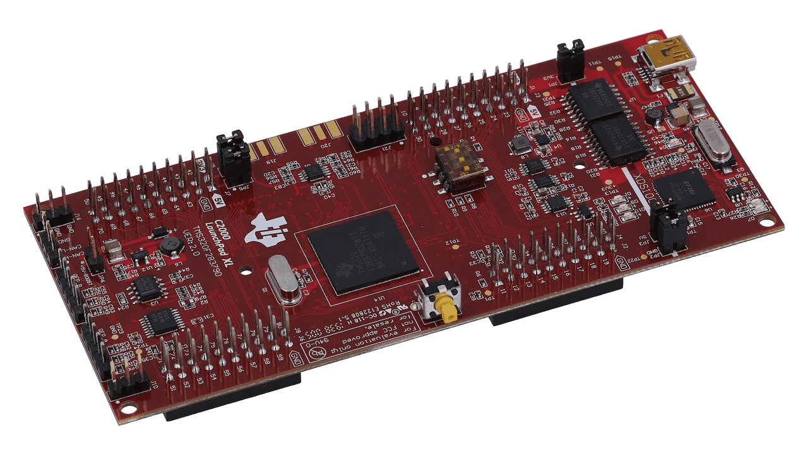

<div id="top"></div>
<!--
*** Thanks for checking out the Best-README-Template. If you have a suggestion
*** that would make this better, please fork the repo and create a pull request
*** or simply open an issue with the tag "enhancement".
*** Don't forget to give the project a star!
*** Thanks again! Now go create something AMAZING! :D
-->


<!-- PROJECT SHIELDS -->
<!--
*** I'm using markdown "reference style" links for readability.
*** Reference links are enclosed in brackets [ ] instead of parentheses ( ).
*** See the bottom of this document for the declaration of the reference variables
*** for contributors-url, forks-url, etc. This is an optional, concise syntax you may use.
*** https://www.markdownguide.org/basic-syntax/#reference-style-links
-->
[![Contributors][contributors-shield]][contributors-url]
[![Forks][forks-shield]][forks-url]
[![Stargazers][stars-shield]][stars-url]
[![Issues][issues-shield]][issues-url]
[![MIT License][license-shield]][license-url]
[![LinkedIn][linkedin-shield]][linkedin-url]


<!-- PROJECT LOGO -->
<br />
<div align="center">
  <a href="https://github.com/dblockil42/UsingF28379D_ForMechatronics">
    
  </a>

  <h3 align="center">Instructing Mechatronics with the Texas Instruments TMS320F28379D</h3>

  <p align="center">
    Mechatronics, Robotics and Real-Time Control with the TI TMS320F28379D Processor
    <br />
    <a href="https://github.com/dblockil42/UsingF28379D_ForMechatronics"><strong>Explore the docs »</strong></a>
    <br />
    <br />
    <a href="https://www.youtube.com/watch?v=pqUko_UUdbc&list=PL-l3usZMjrdI7pazXXURZ83wFKBJd2WC6&index=1">View YouTube Channel</a>
    ·
    <a href="https://github.com/dblockil42/UsingF28379D_ForMechatronics/issues">Report Bug</a>
    ·
    <a href="https://github.com/dblockil42/UsingF28379D_ForMechatronics/issues">Request Feature</a>
  </p>
</div>


<!-- TABLE OF CONTENTS -->
<details>
  <summary>Table of Contents</summary>
  <ol>
    <li>
      <a href="#about-the-project">About The Project</a>
      <ul>
        <li><a href="#built-with">Built With</a></li>
      </ul>
    </li>
    <li>
      <a href="#getting-started">Getting Started</a>
      <ul>
        <li><a href="#prerequisites">Prerequisites</a></li>
        <li><a href="#installation">Installation</a></li>
      </ul>
    </li>
    <li><a href="#usage">Usage</a></li>
    <li><a href="#roadmap">Roadmap</a></li>
    <li><a href="#contributing">Contributing</a></li>
    <li><a href="#license">License</a></li>
    <li><a href="#contact">Contact</a></li>
    <li><a href="#acknowledgments">Acknowledgments</a></li>
  </ol>
</details>


<!-- ABOUT THE PROJECT -->
## About The Project
The TMS320F28379D is an incredibly powerful processor for embedded control design.

I have been teaching with the C2000 series of processors since the early 2000s with the F2407 processor and a bit later the F2808.  Currently in my lab instruction I use the F28335, F28379D and F28027 processors.

I use the F2837x processor in the classes:
- [ME461, Computer Control of Mechanical Systems](http://coecsl.ece.illinois.edu/me461),
- [SE420, Digital Control of Dynamic Systems](http://coecsl.ece.illinois.edu/se420),
- [SE423, Mechatronics](http://coecsl.ece.illinois.edu/se423).  
	
You can find these classes and all the rest of the classes that use the Grainger College of Engineering Control Systems Lab at http://coecsl.ece.illinois.edu  

I have created a YouTube channel that has parts of my SE423 and ME461 lectures describing how to use/program the TMS320F28379D processor.  Please visit [Dan Block's YouTube Channel](https://www.youtube.com/watch?v=pqUko_UUdbc&list=PL-l3usZMjrdI7pazXXURZ83wFKBJd2WC6&index=1)
	
This is a picture and link to a final project that one of the students taking ME461 created. 
[![Product Name Screen Shot][product-screenshot]](https://www.hackster.io/yixiaol2/control-segbot-with-tv-remote-98b02c)
See her additional F28379D based projects at https://www.hackster.io/yixiaol2


<p align="right">(<a href="#top">back to top</a>)</p>


### Built With

Texas Instruments C2000Ware was used to develop the given C2000 projects.  If you are interested in the SYS/BIOS (coming soon) project you will need to also install SYS/BIOS under Code Composer Studio.

* [C2000Ware 4.01](https://www.ti.com/tool/C2000WARE)
* [SYS/BIOS 6.83.00.18](https://software-dl.ti.com/dsps/dsps_public_sw/sdo_sb/targetcontent/bios/sysbios/)

<p align="right">(<a href="#top">back to top</a>)</p>


<!-- GETTING STARTED -->
## Getting Started

You will need to have installed Texas Instruments Code Composer Studio.  I am currently using version 11.2

### Prerequisites

Access to the LAUNCHXL-F28379D Development Board https://www.ti.com/tool/LAUNCHXL-F28379D.

Fabricate the Breakout board I developed for the LAUNCHXL-F28379D https://github.com/dblockil42/UsingF28379D_ForMechatronics/tree/main/EagleCAD_ME461Board.

Knowledge of C programming is very important.

### Installation

_Steps for installing:_

1. Download and install CCS 11.2  [https://www.ti.com/tool/download/CCSTUDIO](https://www.ti.com/tool/download/CCSTUDIO)
2. Download and install C2000Ware 4.01 https://www.ti.com/tool/C2000WARE  Actually not directly needed, as all source code is included in this repository, but by installing C2000Ware you will agree with Texas Instruments License for C2000Ware.  
3. Clone the repo
   ```sh
   git clone https://github.com/dblockil42/UsingF28379D_ForMechatronics.git
   ```
4. Install SYS/BIOS if you would like to use the SYS/BIOS example (coming soon)

<p align="right">(<a href="#top">back to top</a>)</p>


<!-- USAGE EXAMPLES -->
## Usage

Best to start at the YouTube channel :  Coming Soon

For more examples, please refer to the class websites [SE423 (Mechatronics](http://coecsl.ece.illinois.edu/se423) and [ME461 (Computer Control of Mechanical Systems)](http://coecsl.ece.illinois.edu/me461)

<p align="right">(<a href="#top">back to top</a>)</p>


<!-- ROADMAP -->
## Roadmap

- [ ] Add More Starter Projects for additional Peripherals
- [ ] Add SYS/BIOS Starter Project
- [ ] Continue to add videos to YouTube channel explaining the given Starter Projects in detail.

See the [open issues](https://github.com/dblockil42/UsingF28379D_ForMechatronics/issues) for a full list of proposed features (and known issues).

<p align="right">(<a href="#top">back to top</a>)</p>


<!-- CONTRIBUTING -->
## Contributing

Contributions are what make the open source community such an amazing place to learn, inspire, and create. Any contributions you make are **greatly appreciated**.

If you have a suggestion that would make this better, please fork the repo and create a pull request. You can also simply open an issue with the tag "enhancement".
Don't forget to give the project a star! Thanks again!  Please Note, that during the two college semesters I am very busy instructing my classes so I cannot promise how quick I will get to new Pull Requests.  I will do my best to get to them.  

1. Fork the Project
2. Create your Feature Branch (`git checkout -b feature/AmazingFeature`)
3. Commit your Changes (`git commit -m 'Add some AmazingFeature'`)
4. Push to the Branch (`git push origin feature/AmazingFeature`)
5. Open a Pull Request

<p align="right">(<a href="#top">back to top</a>)</p>


<!-- LICENSE -->
## License

Distributed under the  MIT License. See `LICENSE.txt` for more information.

<p align="right">(<a href="#top">back to top</a>)</p>


<!-- CONTACT -->
## Contact

Dan Block -  dblockil42@gmail.com

Project Link: [https://github.com/dblockil42/UsingF28379D_ForMechatronics](https://github.com/dblockil42/UsingF28379D_ForMechatronics)

<p align="right">(<a href="#top">back to top</a>)</p>


<!-- ACKNOWLEDGMENTS -->
## Acknowledgments

Many of my students with their questions helped me put this together!  

* [Template this Readme Started From](https://github.com/othneildrew/Best-README-Template#top)
* [Choose an Open Source License](https://choosealicense.com)
* [GitHub Emoji Cheat Sheet](https://www.webpagefx.com/tools/emoji-cheat-sheet)
* [Malven's Flexbox Cheatsheet](https://flexbox.malven.co/)
* [Malven's Grid Cheatsheet](https://grid.malven.co/)
* [Img Shields](https://shields.io)
* [GitHub Pages](https://pages.github.com)
* [Font Awesome](https://fontawesome.com)
* [React Icons](https://react-icons.github.io/react-icons/search)

<p align="right">(<a href="#top">back to top</a>)</p>


<!-- MARKDOWN LINKS & IMAGES -->
<!-- https://www.markdownguide.org/basic-syntax/#reference-style-links -->
[contributors-shield]: https://img.shields.io/github/contributors/dblockil42/UsingF28379D_ForMechatronics.svg?style=for-the-badge
[contributors-url]: https://github.com/dblockil42/UsingF28379D_ForMechatronics/graphs/contributors
[forks-shield]: https://img.shields.io/github/forks/dblockil42/UsingF28379D_ForMechatronics.svg?style=for-the-badge
[forks-url]: https://github.com/dblockil42/UsingF28379D_ForMechatronics/network/members
[stars-shield]: https://img.shields.io/github/stars/dblockil42/UsingF28379D_ForMechatronics.svg?style=for-the-badge
[stars-url]: https://github.com/dblockil42/UsingF28379D_ForMechatronics/stargazers
[issues-shield]: https://img.shields.io/github/issues/dblockil42/UsingF28379D_ForMechatronics.svg?style=for-the-badge
[issues-url]: https://github.com/dblockil42/UsingF28379D_ForMechatronics/issues
[license-shield]: https://img.shields.io/github/license/dblockil42/UsingF28379D_ForMechatronics.svg?style=for-the-badge
[license-url]: https://github.com/dblockil42/UsingF28379D_ForMechatronics/blob/master/LICENSE.txt
[linkedin-shield]: https://img.shields.io/badge/-LinkedIn-black.svg?style=for-the-badge&logo=linkedin&colorB=555
[linkedin-url]: https://www.linkedin.com/in/dan-block-122b0315/
[product-screenshot]: Segbot.png
